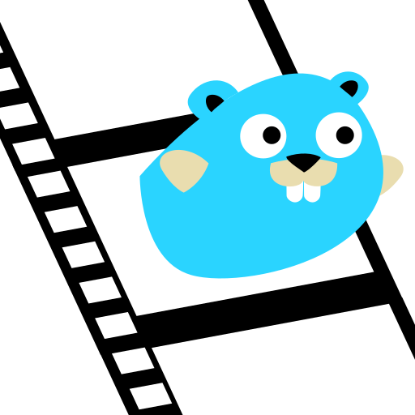

<link rel="shortcut icon" type="image/png" href="logo.png">

[](https://goreportcard.com/report/github.com/gucio321/giu-animations)
[](https://pkg.go.dev/mod/github.com/gucio321/giu-animations)

<h1 align="center">GIU Animations</h1>
<p align="center">

</p>

This is a module for [giu](https://github.com/AllenDang/giu) providing an
animation system.

# Contributors

<table>
<tr>
  <td align="center"><a href="https://github.com/sponsors/gucio321"><br /><sub><b>@gucio321</b><br>Head Developer</sub></a></td>
  <td align="center"><a href="https://instagram.com/sirthunderek5"><br /><sub><b>@sirthunderek</b><br>Logo design</sub></a></td>
</tr>
</table>

# Documentation

## How to use?

For complete code, please check out [examples](./_examples)

### important note

Please make sure that you're using the same version of giu
as this project (technically, you need to use giu version
that uses the same imgui-go version as yours)

### Defining an animation

At the moment, there are three implementations of animations:

- [Transition](#transition) - a smooth transition between two windows/sets of windows e.t.c.
  **NOTE** applying this animation to single widgets is not implemented yet and may
  not work as expected.
- [Color Flow](#color-flow) - you can apply this animation to any widget
  You can configure this animation to make your button hover smoothly or change it into a rainbow!
- [Movement](#move) - moves DrawCursor, emulating moving an object (aka `giu.Widget`).

Lets shortly discuss particular types of animations:

#### Transition

Lets look at the API:

```go
func Transition(renderers ...func(starter func(mode PlayMode))) *TransitionAnimation {...}
```

`renderers` are just [key frames](key-frame) of trasition.
In each stage appropiate renderer is called.
The argument to the renderers is a pointer to Animator.Start (see later)
so that you can call it to play the animation.

#### Color flow

```go
func ColorFlow(
        widget giu.Widget,
        applying []giu.StyleColorID,
        colors ...func() color.RGBA,
) *ColorFlowAnimation {...}
```

- The first argument is a **function** producing a **widget** that the animation should apply to
- next is the list of style-color identifiers. Color changes apply to all of them.
- and the last list of arguments are [key frames](#key-frame) of color flow.

There is also a variant of the above method called `ColorFlowStyle`, which does not need
colors list. These colors are obtained
by function like this:

```go
func() color.RGBA {
    return imgui.CurrentStyle().GetStyleColor(styleID)
}
```

#### Move

```go
func Move(w func(starter StarterFunc) giu.Widget, steps ...*MoveStep) *MoveAnimation {...}
```

This will move `w` around the steps.
Lets take a closer look on steps now:

- You create a step with `Step` or `StepVec` methods.
- You have two options of specifying position:
  - you can make it relative to the previous step. This way the system will
    take position and add it to the position of the previous step
    (and do it until it reaches first step or any step with absolute position)
  - After calling `Absolute()` method of the MoveStep, its position becomes
    absolute so that it does not rely on any previous step.
- An additional feature of Steps is a Bezier Curve implementation.
  In order to enable it, simply call `Bezier` method and specify as many points as you wish.

One more important thing to mention is the first step.
By default, position of the first step you specify **will be treated
absolute, even though it wasn't set to be.** To change this
there are two additional methods of `MoveAnimation`.

- the first one is called `StartPos` and takes one argument of the following type:
  `func(startPos imgui.Vec2) *MoveStep`. It is expected to return non-nil MoveStep.
  `startPos` argument is the position of drawing cursor at the moment **of first call** of
  `Animator`.
- another method is tu simply call `DefaultStartPos` method. It takes no arguments and acts
  like most users would like to use `StartPos` - it returns `Step(startPos)`.

### Easing

These are some additional ways of controlling the flow of animation: 

```go
const (
        EasingAlgNone EasingAlgorithmType = iota
        EasingAlgInSine
        EasingAlgOutSine
        EasingAlgInOutSine
        EasingAlgInBack
        EasingAlgOutBack
        EasingAlgInOutBack
        EasingAlgInElastic
        EasingAlgOutElastic
        EasingAlgInOutElastic
        EasingAlgInBounce
        EasingAlgOutBounce
        EasingAlgInOutBounce
)
```

for further reference, see https://easings.net

### Note about StarterFunc

This interface holds a reference to the part of `AnimatorWidget` responsible
for starting animations. At the moment, there are three functions

- Start(PlayMode) go to the next KeyFrame (forwards or backwards)
- StartKF(base, destination KeyFrame, mode PlayMode) go from `base` to `destination` in `mode` direction (frame by frame)
- StartWhole(mode) - play from 0 to last Key Frame

### Using animator

After constructing an animation, you need to create a special type of giu widget
called `AnimatorWidget`.

You may want to store it in a temporary variable, but, as you'll see later,
animator's api is designed so that you don't need to do so every time.

As an argument to `Animator(...)` constuctor, you pass previously created animation.

Animator has some useful methods:

- `Duration` allows you to specify animation's duration (default is 0.25 s)
- `FPS` sets Frames per second value for animation playback (default is 60)
  **NOTE** it is not real application's FPS! It just describes how often
  animation's status is updated.
- `Start` - this method you can use to invoke animation play.
- `IsRunning` returns true, if animation is being played right now.

#### ID

`AnimatorWidget` has a special ID method that allows you to specify
your own giu-ID. This ID is used to store an internal animator's state
inside of giu context.
Using this method is extremely important if you want to avoid confusing panics
when using TransitionAnimation along with sub-animators inside that animation.
It may happen, that one animator receives the same ID as the previous one.
This may lead to unexpected behaviour or even panic! Its good practice to set
unique ID everywhere!

### Auto triggering

Animator provides a simple way of automated starting of animations.
You can do this by using `Trigger` method. This method takes three arguments:

- `TriggerType` (TriggerNever, TriggerOnChange, TriggerOnTrue) tells Animator when
  to start the animation.
- play mode - tells how to start it
- and the last argument is a trigger function `func() bool` (**TIP** you can use any of `imgui` functions like `imgui.IsItemHovered`)

### Key Frame

Key frames are specific frames of an animation, other frames get interpolated according to them.
All other states between them are calculated on the go.
Key frames system in this module is not very advanced, but it should
suit needs of most users. For more information about implementation
of this system in particular animation types, see above.

## Creating your own animation

You can use this API to create your own animation.
To do soo, lets take a look at the `Animation` interface.

```go
type Animation interface {
        Init()
        Reset()
        KeyFramesCount() int

        BuildNormal(currentKeyFrame KeyFrame, starter func())
        BuildAnimation(animationPercentage, animationPurePercentage float32, startKeyFrame, destinationKeyFrame KeyFrame, starter func())
}
```

_This is a copy from animation.go, but I've removed comments for clarity_

### Init

init is called once, during first call of Animator.Build
you can put some initialization here.

### Reset

Reset is called along with `(*Animator).Start`

### KeyFramesCount

Returns a number of key frames the animation implements.
This number determines behaviour of Animator while calling Start\*

### BuildNormal

is called when `!(*Animator).IsRunning()`
It takes a pointer to `(*Animator).Start` as an argument
so you can easily start animation from there.

### BuildAnimation

is called instead of BuildNormal when playing an animation.
Along with pointer to `(*Animator).Start`, it also receives
current animation progress in percents (0 >= currentPercentage <= 1)
You can do some calculations there.

# Contribution

If you implement something interesting, find any bugs, or
improvements and if you would be so kind to open a PR,
your contribution is welcome!

# Motivation

For now, this system is used in one of [The Greater Heptavirate's](https://github.com/TheGraterHeptavirate) projects.
But (as I'm an author of that system) I've decided to share it for public - feel free to use if you can find any use case.

# License

This project is shared under (attached) [MIT License](LICENSE).
