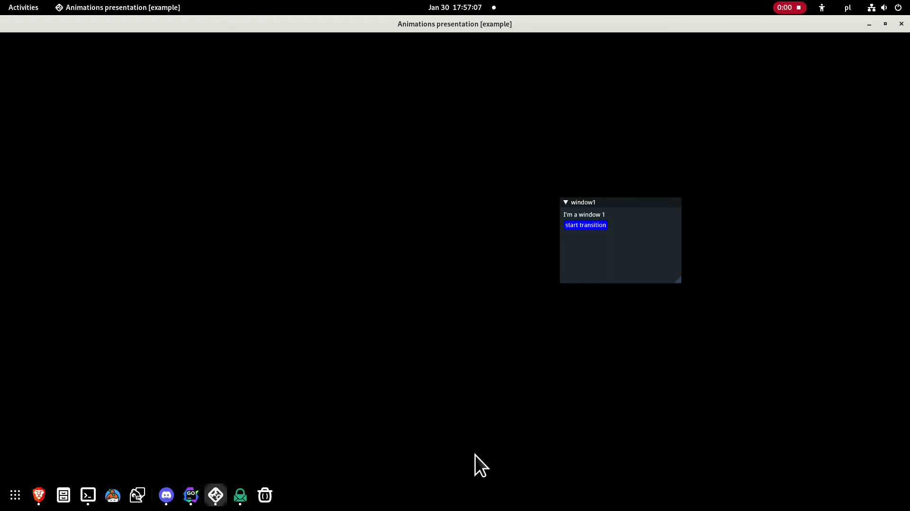

[](https://goreportcard.com/report/github.com/gucio321/giu-animations)
[](https://pkg.go.dev/mod/github.com/gucio321/giu-animations)

# GIU ANIMATIONS

This is a module for [giu](https://github.com/AllenDang/giu) providing an
animation system.



# Documentation

## How to use?

For complete code, please check out [`_examples`](./_examples)

### important note

Please make shure that you're using the same version of giu
as this project (technically, you need to use giu version
that uses the same imgui-go version as yours)

### Defining an animation

At the moment, there are two implementations of animations:
- [Transition](#transition) - a smooth transition between two windows/sets of windows e.t.c.
  **NOTE** applying this animation to single widgets is not implemented yet and may
  not work as expected.
- [on-hover color change](#hover-color) - you can apply this animation to any **single widget**
  that `imgui.IsItemHovered` applies for.
  You can specify any style color you want.
- [Movement](#move) - moves DrawCursor emulating moving an object (`giu.Widget`).

Lets shortly discuss particular types of animations:

#### transition

Lets look at the API:
```go
func Transition(renderer1, renderer2 func(starter func()) *TransitionAnimation {...}
```

`renderer1` and `renderer2` are just two stages of trasition.
In stage 1, `renderer1` is called, and in stage 2 - `renderer2`.
When animation is being plaid, both renderers are called and suitable
alpha value is pushed to imgui style for both of them.

The argument to the poth renderers is a pointer to Animator.Start (see later)
so that you can call it to play the animation.

#### Hover color

```go
func HoverColor(
        widget giu.Widget,
        hoverColor, normalColor func() color.RGBA,
        hoverID, normalID giu.StyleColorID,
) *HoverColorAnimation {...}
```

- The first argument is a widget that should apply to
- hoverColor and normalColor are functions that returns hover and standard (non-hover) colors
- hoverID, normalID - style IDs that hovering applies to.

There is also a variant of the above method called `HoverColorStyle`, which does not need
`hoverColor` and `normalColor` arguments. These colors are obtained
by function like this:
```go
func() color.RGBA {
    return imgui.CurrentStyle().GetStyleColor(styleID)
}
```

#### Move 

```go
Move(
    w giu.Widget,
    delta imgui.Vec2,
) *MoveAnimation {...}
```

This will mmove `w` from the position, it was
at the moment of calling `Move(...)` (called `start`)
to `start` + `delta`.

##### Easing

There are some extra ways of playing animation flow:

```go
const (
        EasingAlgNone EasingAlgorithmType = iota
        EasingAlgInSine
        EasingAlgOutSine
        EasingAlgInOutSine
        EasingAlgInBack
        EasingAlgOutBack
        EasingAlgInOutBack
        EasingAlgInElastic
        EasingAlgOutElastic
        EasingAlgInOutElastic
        EasingAlgInBounce
        EasingAlgOutBounce
        EasingAlgInOutBounce
)
```

for further reference, see https://easings.net

##### Bezier curve

Move animation supports [Bezier Curve](https://pomax.github.io/bezierinfo/).
It meas that move animation could be very smooth if you find it necessary.
You have two ways to calculate these points:
- go through [google](https://google.com) and use tone of paper to understand this strange math or
- just type random values and check what happens :smile:

The api looks as follows:

```go
func (m *MoveAnimation) Bezier(controlPoints ...imgui.Vec2) *MoveAnimation {...}
```

you can add as many control points as you which to.
Each point will make the curve stranger.
The only thing you need to remember is, that **these points
are relative to `startPos`**. They will automatically become `startPos` + `controlPoint`.

### Using animator

After constructing an animation, you need to create a special type of giu widget
called `AnimatorWidget`.

You may want to store it in a temporary variable, but, as you'll see later,
animator's api is designed so that you don't need to do so every time.

As an argument to `Animator(...)` constuctor, you pass perviously created animation.

Animator has some useful methods:
- `Duration` allows you to specify animation's duration (default is 0.25 s)
- `FPS` sets Frames per second value for animation playback (default is 60)
   **NOTE** it is not real application's FPS! It just describes how often
   animation's status is updated.
- `Start` - this method you can use to invoke animation play.
- `IsRunning` returns true, if animation is being plaid right now.

## Creating your own animation

You can use this API to create your own animation.
To do soo, lets take a look on `Animation` interface.
```go
type Animation interface {
        Init()
        Reset()

        BuildNormal(starter func())
        BuildAnimation(animationPercentage float32, starter func())
}
```

_This is a copy from animation.go, but I've removed comments for clearity_

### Init

init is called once, during first call of Animator.Build
you can put some initialization here.

### Reset

Reset is called along with `(*Animator).Start`

### BuildNormal

is called when `!(*Animator).IsRunning()`
It takes a pointer to `(*Animator).Start` as an argument
so you can easily start animation from there.

### BuildAnimation

is called instead of BuildNormal when playing an animation.
Along with pointer to `(*Animator).Start`, it also receives
current animation progress in percents (0 >= currentPercentage <= 1)
You can do some calculations there.

# Contribution

If you implement something interessting, find any bugs, or
improvements and would be so kind to open a PR,
your contribution is welcome!

# Motivation

For now, this system is used in one of [The Greater Heptavirate's](https://github.com/TheGraterHeptavirate) projects.
But (as I'm an author of that system) I've decided to share it for public - feel free to use if you can find any use case.

# License

This project is shared under (attached) MIT License.
